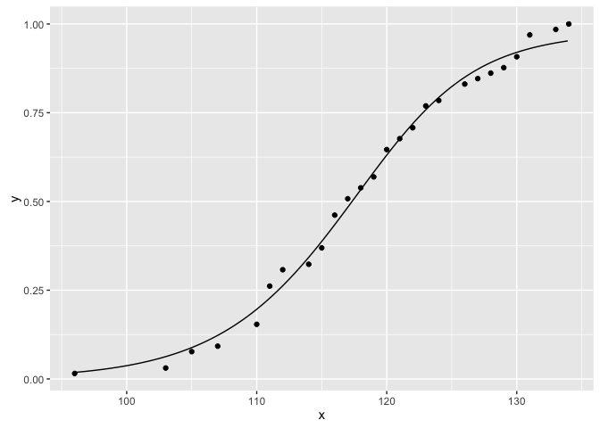

<!-- README.md is generated from README.Rmd. Please edit that file -->
nlstimedist
===========

[](http://www.repostatus.org/#active) [](https://travis-ci.org/NattyE/nlstimedist) [](https://codecov.io/gh/NattyE/nlstimedist)

nlstimedist fits a biologically meaningful distribution function to time-sequence data (phenology), estimates parameters to draw the cumulative distribution function and probability density function and calculates standard statistical moments and percentiles.

Installation
============

You can install:

-   the latest released version from CRAN with

``` r
install.packages("nlstimedist")
```

-   the latest development version from GitHub with

``` r
devtools::install_github("NattyE/nlstimedist")
```

Usage
=====

Preparing the data
------------------

Data should be in tidy format. `nlstimedist` provides three example tidy datasets: `lobelia`, `pupae` and `tilia`.

``` r
head(tilia)
#>   Day Trees
#> 1  94     0
#> 2  95     0
#> 3  96     1
#> 4 103     1
#> 5 104     0
#> 6 105     3
```

We first need to calculate the cumulative number of trees as well as the proportions. We do this using the `tdData` function.

``` r
tdTilia <- tdData(tilia, x = "Day", y = "Trees")
tdTilia
#> # A tibble: 26 × 4
#>      Day Trees  cumN    propMax
#>    <int> <dbl> <dbl>      <dbl>
#> 1     96     1     1 0.01538462
#> 2    103     1     2 0.03076923
#> 3    105     3     5 0.07692308
#> 4    107     1     6 0.09230769
#> 5    110     4    10 0.15384615
#> 6    111     7    17 0.26153846
#> 7    112     3    20 0.30769231
#> 8    114     1    21 0.32307692
#> 9    115     3    24 0.36923077
#> 10   116     6    30 0.46153846
#> # ... with 16 more rows
```

Fitting the model
-----------------

We fit the model to the proportion of the cumulative number of trees (`propMax`) in the `tdTilia` data using the `timedist` function.

``` r
model <- timedist(data = tdTilia, x = "Day", y = "propMax", r = 0.1, c = 0.5, t = 120)
model
#> Nonlinear regression model
#>   model: propMax ~ 1 - (1 - (r/(1 + exp(-c * (Day - t)))))^Day
#>    data: data
#>         r         c         t 
#>   0.02721   0.17126 124.84320 
#>  residual sum-of-squares: 0.01806
#> 
#> Number of iterations to convergence: 10 
#> Achieved convergence tolerance: 1.49e-08
```

Extracting the moments
----------------------

We can extract the mean, variance, standard deviation, skew, kurtosis and entropy of the model as follows.

``` r
model$m$getMoments()
#>       mean variance       sd     skew kurtosis entropy
#> 1 118.0325 180.7509 13.44436 4.324762 46.82073 5.36145
```

Extracting the RSS
------------------

Similarly we can extract the RSS of the model

``` r
model$m$rss()
#> [1] 0.9930469
```

Plotting the PDF and CDF
------------------------

The pdf and cdf of the model have their own plotting functions.

``` r
tdPdfPlot(model)
```


``` r
tdCdfPlot(model)
```



Citation
========

Franco, M. (2012). *The time-course of biological phenomenon - illustrated with the London Marathon*. Unpublished manuscript. Plymouth University.
