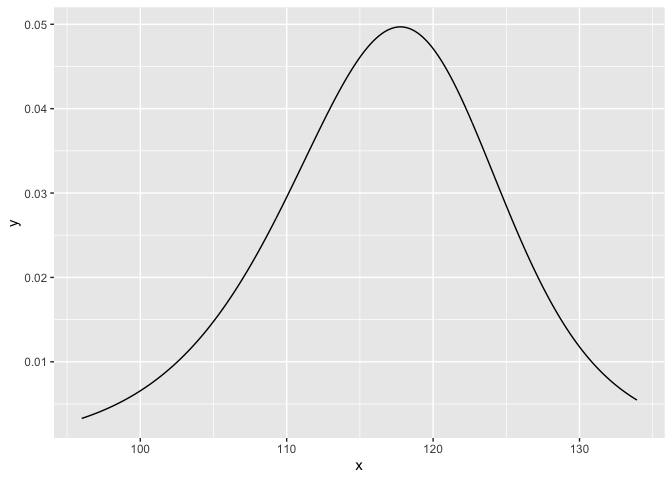

{nlstimedist}
=============

[](https://www.repostatus.org/#active)
[](https://travis-ci.org/nathaneastwood/nlstimedist)
[](https://www.r-pkg.org/pkg/nlstimedist)

[](https://codecov.io/gh/nathaneastwood/nlstimedist)

{nlstimedist} fits a biologically meaningful distribution function to
time-sequence data (phenology), estimates parameters to draw the
cumulative distribution function and probability density function and
calculates standard statistical moments and percentiles.

Installation
------------

You can install:

-   the latest released version from CRAN with

``` r
install.packages("nlstimedist")
```

-   the latest development version from GitHub with

``` r
# install.packages("remotes")
remotes::install_github("nathaneastwood/nlstimedist")
```

Usage
-----

### Preparing the data

Data should be in tidy format. {nlstimedist} provides three example tidy
datasets: `lobelia`, `pupae` and `tilia`.

``` r
library(nlstimedist)
head(tilia)
#   Day Trees
# 1  94     0
# 2  95     0
# 3  96     1
# 4 103     1
# 5 104     0
# 6 105     3
```

We first need to calculate the cumulative number of trees as well as the
proportions. We do this using the `tdData()` function.

``` r
tdTilia <- tdData(tilia, x = "Day", y = "Trees")
tdTilia
#    Day Trees cumN    propMax
# 3   96     1    1 0.01538462
# 4  103     1    2 0.03076923
# 6  105     3    5 0.07692308
# 8  107     1    6 0.09230769
# 10 110     4   10 0.15384615
# 11 111     7   17 0.26153846
# 12 112     3   20 0.30769231
# 14 114     1   21 0.32307692
# 15 115     3   24 0.36923077
# 16 116     6   30 0.46153846
# 18 117     3   33 0.50769231
# 19 118     2   35 0.53846154
# 20 119     2   37 0.56923077
# 21 120     5   42 0.64615385
# 22 121     2   44 0.67692308
# 23 122     2   46 0.70769231
# 24 123     4   50 0.76923077
# 25 124     1   51 0.78461538
# 27 126     3   54 0.83076923
# 28 127     1   55 0.84615385
# 29 128     1   56 0.86153846
# 30 129     1   57 0.87692308
# 31 130     2   59 0.90769231
# 32 131     4   63 0.96923077
# 33 133     1   64 0.98461538
# 34 134     1   65 1.00000000
```

### Fitting the model

We fit the model to the proportion of the cumulative number of trees
(`propMax`) in the `tdTilia` object using the `timedist()` function.

``` r
model <- timedist(data = tdTilia, x = "Day", y = "propMax", r = 0.1, c = 0.5, t = 120)
model
# Nonlinear regression model
#   model: propMax ~ 1 - (1 - (r/(1 + exp(-c * (Day - t)))))^Day
#    data: data
#         r         c         t
#   0.02721   0.17126 124.84320
#  residual sum-of-squares: 0.01806
#
# Number of iterations to convergence: 10
# Achieved convergence tolerance: 1.49e-08
```

### Extracting the moments

We can extract the mean, variance, standard deviation, skew, kurtosis
and entropy of the model as follows.

``` r
model$m$getMoments()
#       mean variance       sd     skew kurtosis entropy
# 1 118.0325 180.7509 13.44436 4.324762 46.82073 5.36145
```

### Extracting the RSS

Similarly we can extract the RSS of the model

``` r
model$m$rss()
# [1] 0.9930469
```

### Plotting the PDF and CDF

The probability density function (PDF) and the cumulative distribution
function (CDF) of the model have their own plotting functions.

``` r
tdPdfPlot(model)
```



``` r
tdCdfPlot(model)
```


